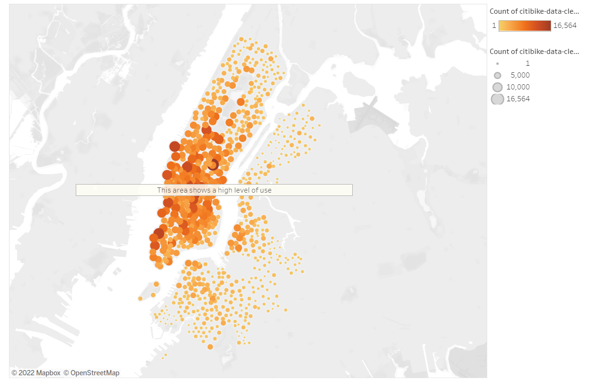
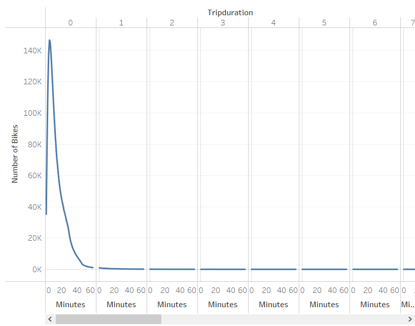
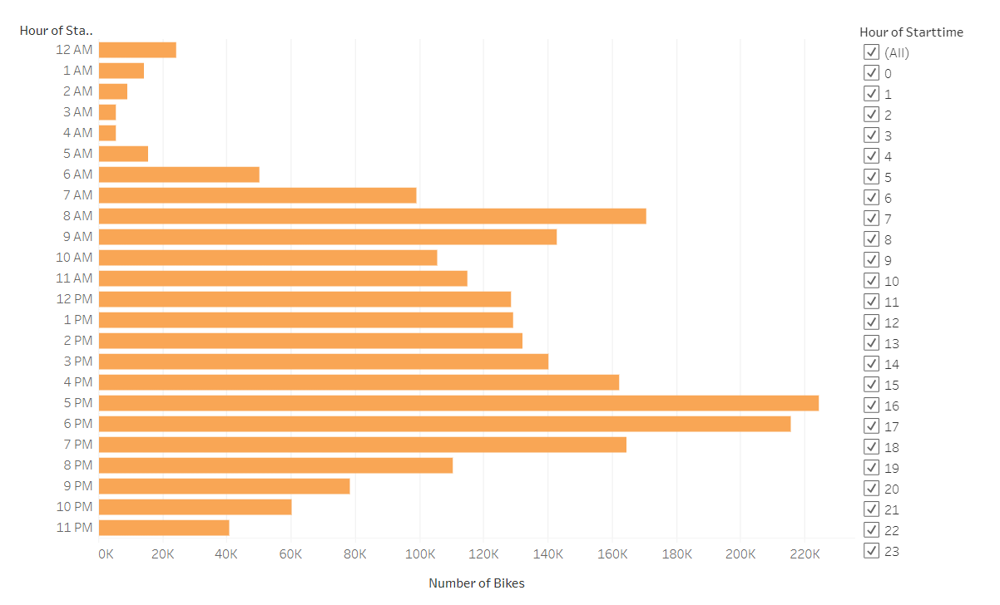
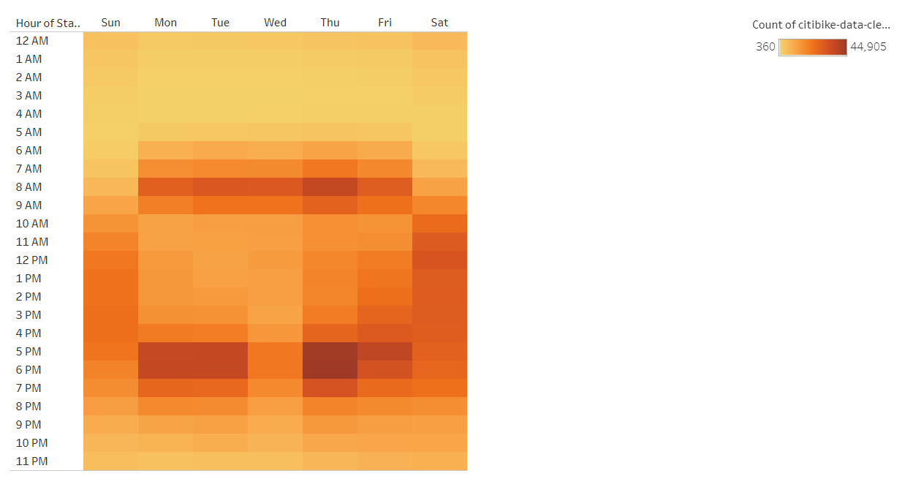
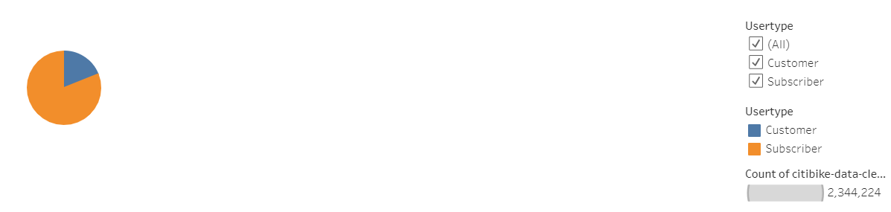
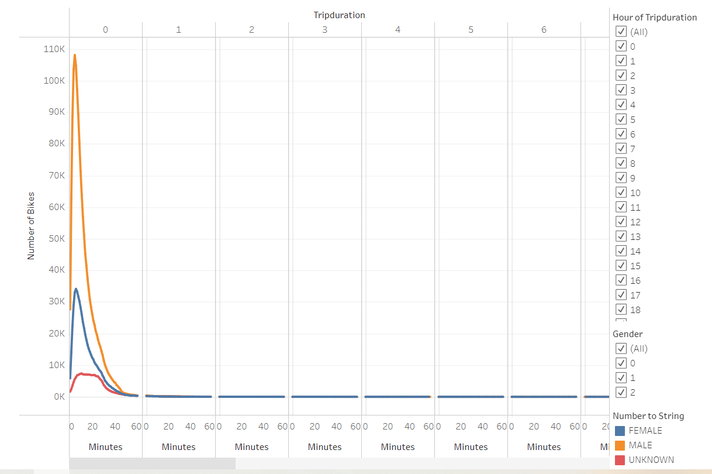
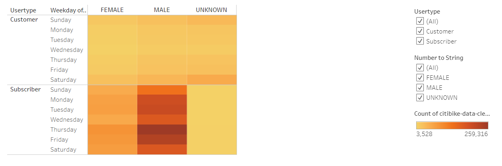

# bikesharing

## Project Overview

The client would like to start a bike ride-sharing program in their home town of Des Moines, Iowa. They've gathered data from the bike ride-sharing program from New York City. Using this data, they would like to show their potential investors the value in starting a similar bike-sharing program in Des Moines. 

## Results and Analysis

### CitiBank Ride-Sharing Data

The data the client gathered was from the [CitiBank ride-sharing program](Resources/201908-citibike-tripdata-challenge.csv) located in New York City. The data was relatively clean and required minimal manipulation. The Tripduration column was modified to show a date and time. The resulting file is the [clean ride-sharing data](Resources/citibike-data-clean.csv).

### Tableau Story

The clean data was loaded on Tableau to easily extract and visualize the desired endpoints. Here is the [link to the story](https://public.tableau.com/views/CitiBike-ridesharing-data/CitiBikeRidingData?:language=en-US&publish=yes&:display_count=n&:origin=viz_share_link).

In the story, we can see that Manhattan has a huge customer base for the bike ride-sharing program. It is most popular in densely populated areas. As a bustling city, Des Moines would also fit in this mould and would then be a good candidate for the program. 

### Different Types of Uses

From the client's data, we can also visualize the various ways the bikes are being used. The below graphic shows that users typically use the bike for less than an hour.

We can also extract the time of day the bikes are used most. The data shows that the bikes are used most around 5pm-7pm. We also see a small peak in the morning, around 8am-9am. 

If we break down the data further by day of the week, we can clearly see that the bike-sharing program provides a great way for customers to commute to and from work. The graphic below shows a heatmap of the use, where the color red demonstrates greater use.

### Customer Base

The data also contained some limited insight in the customer base. The bike-sharing program allows for short-term use or longer term subscriptions. Using this information, we may be able to better tailor any future advertising to encourage long-term subscriptions. The data below actually demonstrates most users opt for the subscription services.

Below, the data suggests that men use the service more often than women. Men typically ride during rush hour, likely to commute to work. Men also tend to ride a little longer than women. The riding pattern for women is more evenly distributed and suggests a shorter ride time.

If we look at the type of customer by gender, we can see that men have a higher tendency to become long-term subscribers.

## Summary

The bike ride-sharing program has a lot of potential, especially for a city like Des Moines. The program can provide an economical and environmentally friendly mode of transport for our city dwellers to commute to their place of work. These users can take advantage of the subscription service. The program also offers a fun way for tourists to explore our city through short-term self-serve rentals.

The data shows that men are more likely to use the service as a subscription service so they can easily commute to work. Women seem to use the service for more leisurely purposes. It would also be interesting to view the type of customer by age groups. The riding pattern (e.g. time of use and ride-time) by age group would also reveal potential ways to target advertising.